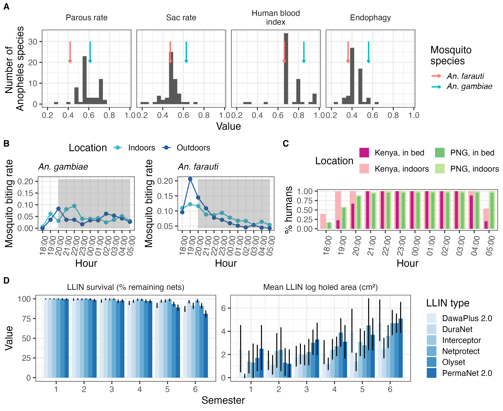

# Opdracht 4: reproduceerbare data

## Opdracht 4a: Een data analyse van een ander reproduceren

In deze opdracht wordt data onderzocht afkomstig van het HU lectoraat Innovative Testing in Life Sciences & Chemistry. In het experiment zijn C. elegans blootgesteld aan verschillende concentraties van verschillende chemicaliën. Vervolgens is het aantal nakomelingen bepaald.
Het doel van deze analyse is om de data reproduceerbaar te verwerken en te visualiseren in R.

```{r message=FALSE, warning=FALSE}
library(readxl)
library(dplyr)
library(ggplot2)
library(forcats)
```

```{r}
data <- read.csv("data/celegans_data.csv")
```
##controle
Eerste controleren of data goed is ingelezen

```{r}
head(data)
str(data)
summary(data)
data %>%
  select(RawData, compName, compConcentration, expType) %>%
  glimpse()
```

```{r}
data <- data %>%
  mutate(
    RawData = as.numeric(RawData),
    compName = as.factor(compName),
    compConcentration = as.numeric(compConcentration),
    expType = as.factor(expType)
  )
str(data)
```

```{r fig.width=10, fig.height=6}
ggplot(data, aes(x = compConcentration, y = RawData, color = compName, shape = expType)) +
  geom_jitter(width = 0.05, height = 0, alpha = 0.8, size = 2.5) +
  scale_x_log10() +
  labs(
    title = "Aantal nakomelingen per concentratie en chemicalie",
    x = "Concentratie (log10 schaal)",
    y = "RawData (aantal nakomelingen)",
    color = "Chemicalie",
    shape = "Experimenteel type"
  ) +
  theme_minimal() +
  theme(axis.text.x = element_text(angle = 45, hjust = 1))
```

Er is een log10-transformatie gebruikt op de x-as om verschillen in concentratie beter zichtbaar te maken. Daarnaast is jitter toegevoegd om te voorkomen dat punten exact over elkaar heen vallen.

## Normalisatie op de negatieve controle

Eerst bereken ik het gemiddelde van de negatieve controle.

```{r}
neg_control_mean <- data %>%
  filter(expType == "controlNegative") %>%
  summarise(mean_neg = mean(RawData, na.rm = TRUE)) %>%
  pull(mean_neg)

neg_control_mean
```

```{r}
data <- data %>%
  mutate(RawData_norm = RawData / neg_control_mean)
data %>%
  filter(expType == "controlNegative") %>%
  summarise(mean_normalized_negative = mean(RawData_norm, na.rm = TRUE))
```

##Scatterplot met genormaliseerde waarde
```{r fig.width=10, fig.height=6}
ggplot(data, aes(x = compConcentration, y = RawData_norm, color = compName, shape = expType)) +
  geom_jitter(width = 0.05, height = 0, alpha = 0.8, size = 2.5) +
  scale_x_log10() +
  labs(
    title = "Genormaliseerd aantal nakomelingen per concentratie en chemicalie",
    x = "Concentratie (log10 schaal)",
    y = "Genormaliseerde RawData (fractie van negatieve controle)",
    color = "Chemicalie",
    shape = "Experimenteel type"
  ) +
  theme_minimal() +
  theme(axis.text.x = element_text(angle = 45, hjust = 1))
```

## Controles in het experiment

## Negatieve controle

De negatieve controle is de conditie waarin geen toxisch effect wordt verwacht. In deze dataset is dat de `controlNegative`. Deze controle geeft het normale aantal nakomelingen weer onder standaardomstandigheden.

## Positieve controle

De positieve controle is een conditie waarvan verwacht wordt dat deze duidelijk een effect veroorzaakt. Daarmee kan worden gecontroleerd of het experiment gevoelig genoeg is om een biologisch effect te detecteren.

## Vehicle controle

De vehicle controle bevat alleen het oplosmiddel waarin een stof is opgelost, zonder de werkzame stof zelf. Hiermee kan worden nagegaan of het oplosmiddel zelf invloed heeft op het aantal nakomelingen.

## Nut van de verschillende controles

De negatieve controle laat zien wat de normale baseline is zonder behandeling.

De positieve controle laat zien of het experiment in staat is om een effect te detecteren.

De vehicle controle laat zien of het oplosmiddel zelf een effect veroorzaakt. Dit is belangrijk, omdat anders een effect onterecht aan het chemicalie zou kunnen worden toegeschreven.

## Nut van de normalisatie

De data zijn genormaliseerd ten opzichte van de negatieve controle, zodat de gemiddelde waarde van de negatieve controle gelijk wordt aan 1.

Het voordeel hiervan is dat alle meetwaarden direct vergeleken kunnen worden met de baseline. Hierdoor wordt het eenvoudiger om te zien of een behandeling leidt tot minder of juist meer nakomelingen dan verwacht onder normale omstandigheden.

Een waarde kleiner dan 1 betekent minder nakomelingen dan in de negatieve controle. Een waarde groter dan 1 betekent meer nakomelingen dan in de negatieve controle.

## Stappenplan voor vervolgonderzoek

Een logische vervolgstap voor dit type data is een dose-response analyse met een log-logistisch model om de IC50 te bepalen. Hiervoor kan in R het package `drc` gebruikt worden.

## Stap 1: package installeren en laden

```{r eval=FALSE}
install.packages("drc")
library(drc)
```

## Stap 2: data selecteren voor één chemicalie

```{r eval=FALSE}
chem_data <- data %>%
  filter(compName == "naam_van_chemicalie")
```

## Stap 3: model fitten

```{r eval=FALSE}
model <- drm(RawData_norm ~ compConcentration, data = chem_data, fct = LL.4())
```

## Stap 4: model samenvatten

```{r eval=FALSE}
summary(model)
```

## Stap 5: dose-response curve plotten

```{r eval=FALSE}
plot(model)
points(chem_data$compConcentration, chem_data$RawData_norm)
```

## Stap 6: IC50 berekenen

```{r eval=FALSE}
ED(model, 50, interval = "delta")
```

## Stap 7: herhalen voor andere chemicaliën

Dezelfde stappen kunnen worden herhaald voor andere chemicaliën, zodat de IC50-waarden onderling vergeleken kunnen worden.


## Conclusie

In deze analyse is de dataset ingelezen, gecontroleerd op correcte datatypes en gevisualiseerd met scatterplots. Daarna zijn de meetwaarden genormaliseerd ten opzichte van de negatieve controle, zodat de resultaten beter vergelijkbaar zijn.

Een logische vervolgstap is het uitvoeren van een dose-response analyse met een log-logistisch model, waarmee per chemicalie een IC50 kan worden geschat.

## Opdracht 4b: Een artikel beoordelen op reproduceerbaarheid

In deze opdracht ga ik de reproduceerbaarheid van een artikel beoordelen. 

## Onderdeel 1:

Voor deze opdracht heb ik gekozen voor een artikel uit PLOS Computational Biology waarin een R-package staat voor het modelleren van de invloed van malariabestrijding op verschillende soorten Anopheles-muggen.

## Referentie

Golumbeanu, M., Briët, O., Champagne, C., Lemant, J., Winkel, M., Zogo, B., et al. (2024). *AnophelesModel: An R package to interface mosquito bionomics, human exposure and intervention effects with models of malaria intervention impact*. **PLOS Computational Biology, 20**(9), e1011609. [https://doi.org/10.1371/journal.pcbi.1011609](https://doi.org/10.1371/journal.pcbi.1011609)

## Onderzoeksvraag

De onderzoeksvraag van het artikel is hoe een R-package gebruikt kan worden om gegevens over muggensoorten, menselijk gedrag en bestrijdingsmaatregelen te combineren, zodat het verwachte effect van malariabestrijding in verschillende geografische situaties beter gemodelleerd kan worden.

## Korte samenvatting van de methode

De onderzoekers hebben een R-package gemaakt dat AnophelesModel heet. Met dit package kunnen ze gegevens over verschillende soorten malariamuggen combineren met informatie over mensen en maatregelen tegen malaria. Er wordt bijvoorbeeld gekeken naar wanneer en waar muggen mensen bijten, maar ook naar het gebruik van klamboes met insecticide, het spuiten van insecticide binnenshuis en het beter afsluiten van huizen tegen muggen.

Met al deze gegevens kan het package berekenen hoe goed een bepaalde maatregel waarschijnlijk werkt. Het kijkt daarbij naar de kans dat muggen malaria kunnen overbrengen op mensen. Zo kunnen de onderzoekers vergelijken welke maatregel het beste werkt in een bepaalde situatie of bij een bepaalde muggensoort.


## Korte samenvatting van de resultaten

De onderzoekers testen het package met twee verschillende soorten malariamuggen: Anopheles gambiae en Anopheles farauti. Deze muggen gedragen zich niet hetzelfde. Ze bijten bijvoorbeeld op andere momenten of op andere plekken. Uit het model blijkt dat klamboes met insecticide waarschijnlijk beter werken tegen Anopheles gambiae in een situatie zoals in Kenia, dan tegen Anopheles farauti in een situatie zoals in Papoea-Nieuw-Guinea.

Hieruit blijkt dat een maatregel tegen malaria niet overal even goed werkt. Dit hangt bijvoorbeeld af van welke muggensoort er voorkomt, wanneer en waar deze mug mensen bijt en hoe mensen zich gedragen.

## Onderdeel 2:

Om te beoordelen hoe transparant en reproduceerbaar het gekozen artikel is, heb ik het artikel beoordeeld aan de hand van verschillende criteria. Hierbij heb ik gekeken of belangrijke informatie over het doel, de data, de code, de financiering en eventuele ethische aspecten duidelijk beschreven is.

| Criterium | Beoordeling | Bevinding |
|---|---|---|
| Study Purpose | Ja | Het doel van het artikel is duidelijk beschreven. De onderzoekers hebben het R-package AnophelesModel ontwikkeld om te voorspellen hoe goed verschillende maatregelen tegen malaria werken bij verschillende muggensoorten en in verschillende situaties. |
| Data Availability Statement | Ja | Het artikel bevat een aparte sectie met de titel Data Availability. Hierin staat waar de R-code, documentatie en code voor de figuren te vinden zijn. |

| Data Location | Gevonden | De code en data van het package zijn beschikbaar via GitHub: [SwissTPH/AnophelesModel](https://github.com/SwissTPH/AnophelesModel). De code voor de analyses en figuren uit het artikel staat in de map `extdata` van dezelfde repository. |
| Study Location | Ja | Het artikel gebruikt voorbeelden voor twee situaties: een Kenia-achtige setting voor Anopheles gambiae en een Papoea-Nieuw-Guinea-achtige setting voor Anopheles farauti. Het gaat hierbij om modelanalyses op basis van bestaande gegevens en niet om één nieuw experiment op één locatie. |
| Author Review | Gevonden | De eerste auteur, Monica Golumbeanu, heeft een professioneel e-mailadres van het Swiss Tropical and Public Health Institute opgegeven: `monica.golumbeanu@swisstph.ch`. |
| Ethics Statement | Nee | Ik heb in het artikel geen aparte ethics statement gevonden. Het artikel beschrijft een R-package en gebruikt eerder verzamelde en openbare gegevens, maar er staat geen aparte verklaring over ethische goedkeuring of gevoelige data. |
| Funding Statement | Ja | Het artikel bevat een funding statement. Hierin staat dat het onderzoek mede is gefinancierd door de Bill & Melinda Gates Foundation. Ook staat vermeld dat de financiers geen rol hadden in het ontwerp, de analyse of de publicatie van het onderzoek. |
| Code Availability | Ja | De R-code van AnophelesModel is openbaar beschikbaar via GitHub. Daarnaast geven de auteurs aan dat de code waarmee de resultaten en figuren uit het artikel zijn gemaakt ook online beschikbaar is. |

## Beoordeling

Op basis van de criteria vind ik het artikel duidelijk en goed te herhalen. De onderzoekers leggen goed uit wat het doel van hun onderzoek is. Daarnaast hebben ze de R-code, de gebruikte data en uitleg over het package gedeeld. Ook is te vinden welke code zij hebben gebruikt om de figuren uit het artikel te maken. Hierdoor kan ik zelf proberen om een analyse of figuur opnieuw uit te voeren.

Een aandachtspunt is dat ik geen aparte verklaring over ethiek in het artikel heb gevonden. Omdat het onderzoek vooral gaat over een R-package en bestaande data gebruikt, denk ik niet dat dit een groot probleem is voor deze opdracht. Voor het herhalen van de analyse is het vooral belangrijk dat de code, data en uitleg beschikbaar zijn. Dat is bij dit artikel goed geregeld.

## Onderdeel 3:

##Beschikbaarheid van de code en data

De onderzoekers hebben de R-code van het package AnophelesModel gedeeld via GitHub. In dezelfde GitHub-repository staat ook een map met de naam extdata. In deze map staan scripts waarmee de onderzoekers figuren uit het artikel hebben gemaakt.

Voor deze opdracht ga ik proberen om Figuur 2 opnieuw te maken. Hiervoor gebruik ik het script example_fig2.R.


## Wat doet de R-code?

De R-code gebruikt het package AnophelesModel om gegevens over malariamuggen, mensen en maatregelen tegen malaria te verwerken. In het script voor Figuur 2 worden twee soorten malariamuggen met elkaar vergeleken: Anopheles gambiae en Anopheles farauti.

De code gebruikt verschillende soorten gegevens. Er wordt bijvoorbeeld gekeken naar wanneer en waar de muggen mensen bijten. Ook wordt gekeken naar het gedrag van mensen en naar het effect van klamboes met insecticide.

Met deze gegevens maakt de code meerdere grafieken die samen Figuur 2 vormen. In deze figuur wordt zichtbaar dat maatregelen tegen malaria niet bij elke muggensoort of in elke situatie hetzelfde effect hebben.

## Beoordeling van de leesbaarheid van de code

Voordat ik de code zelf heb uitgevoerd, geef ik de leesbaarheid van de code voorlopig een 3 van de 5. Het is handig dat het script example_fig2.R heet, omdat hierdoor meteen duidelijk is dat dit bestand gebruikt wordt voor Figuur 2. Ook staan er opmerkingen in de code die helpen om te begrijpen wat bepaalde delen doen. Toch vind ik de code niet meteen heel eenvoudig om te lezen. Er worden meerdere gegevens en onderdelen van het package gebruikt. Daardoor is het in het begin lastig om precies te zien welke regels nodig zijn om de figuur opnieuw te maken. Nadat ik de code zelf heb uitgevoerd, kan ik beter beoordelen hoe duidelijk en gebruiksvriendelijk de code echt is.

## Een figuur opnieuw maken

Om te testen of de analyse reproduceerbaar is, ga ik proberen om Figuur 2 uit het artikel opnieuw te maken. Hiervoor download ik de gedeelde R-code en installeer ik het package AnophelesModel.

Tijdens het uitvoeren van de code houd ik bij welke stappen ik moet uitvoeren en of ik foutmeldingen tegenkom. Als er fouten ontstaan, noteer ik hoe ik deze probeer op te lossen. Op basis daarvan kan ik uiteindelijk beoordelen hoe makkelijk het is om de gedeelde code opnieuw uit te voeren.


## Uitvoeren van de gedeelde code

Om te testen of de code reproduceerbaar is, heb ik een nieuw R-project gemaakt. Daarna heb ik het package AnophelesModel geïnstalleerd vanaf GitHub en het script example_fig2.R samen met het benodigde databestand gedownload.

Bij het uitvoeren van het script werkte de code niet meteen. Het eerste probleem was dat in het script een pad stond naar een map op de computer van de onderzoekers. Hierdoor kon R het bestand PNG_human_patterns.csv op mijn laptop niet vinden.

Ik heb het oorspronkelijke pad vervangen door het pad naar het bestand in mijn eigen projectmap:

```{r, eval=FALSE}
"gedeelde_code/PNG_human_patterns.csv"
```

Daarna kreeg ik een tweede foutmelding. Het package `reshape2` was nog niet geïnstalleerd op mijn laptop. Dit heb ik opgelost door het package te installeren:

```{r, eval=FALSE}
install.packages("reshape2")
```

Na deze twee aanpassingen kon ik het script uitvoeren en verscheen de figuur in RStudio. Het is mij dus gelukt om met de gedeelde R-code een figuur uit het artikel opnieuw te maken.

## Resultaat

Onderstaande afbeelding laat de figuur zien die ik met het gedeelde script heb kunnen reproduceren.

```{r, echo=FALSE, out.width="100%"}

```

## Beoordeling van de reproduceerbaarheid

Ik geef de reproduceerbaarheid van de code een 3 van de 5. De onderzoekers hebben de code en de benodigde data gedeeld via GitHub. Ook was duidelijk welk script bij Figuur 2 hoorde. Nadat ik twee problemen had opgelost, kon ik de figuur opnieuw maken.

Ik geef geen 5 van de 5, omdat de code niet meteen werkte op mijn laptop. Ik moest eerst een bestandspad aanpassen en een ontbrekend package installeren. Als de onderzoekers een duidelijke lijst met benodigde packages hadden toegevoegd en geen persoonlijk bestandspad in de code hadden gebruikt, was het makkelijker geweest om de analyse direct te herhalen.
